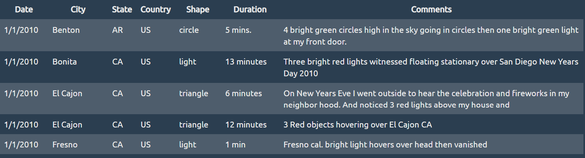
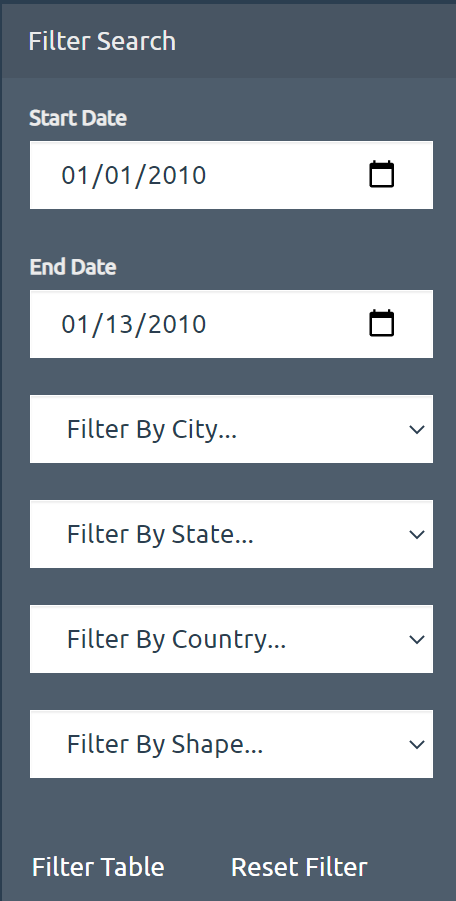

# JavaScript DOM Manipulation

The purpose of this assignment was to practice modifying web pages using Javascript and D3. I used both technologies to filter and display UFO sighting data into a bootstrap table.

The dataset included the following features
- Date of the sighting
- City where the UFO was sighted
- State where the UFO was sighted
- Country where the UFO was sighted
- Shape of the sighting
- Duration of the sighting
- Any comments associated with the sighting

The data filter takes input from a form and updates the table with data that meets the form criteria. The start and end date fields default to the minimum and maximum dates of the dataset. The other filterable fields (city, state, country, and shape) are controlled by select menus. Their options are automatically generated using each fields unique values. Also included is a button to reset the form to it's default values.

